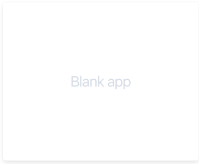
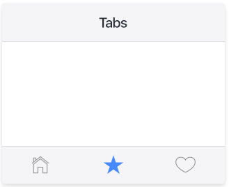
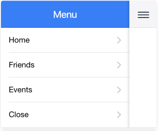

# Notas IONIC
## Primeros Pasos
### Instalación
Ejecutar lo siguiente por consola (se debe tener instalado NodeJS):
```
$ npm install -g cordova ionic
```

### Crear una aplicación
Para crear el proyecto ejecutar lo siguiente:
```
$ ionic start miApp tabs
```
`miApp` es el nombre con el cual será creado el proyecto.

Existen varios templates con los cuales uno puede crear la aplicación:

- `$ ionic start miApp blank`

- `$ ionic start miApp tabs`

- `$ ionic start miApp sidemenu`



### Ejecutar la aplicación
Para ejecutar la aplicación se debe ingresar al 
directorio del proyecto y levantar el server.

```
$ cd miApp
$ ionic serve
```
